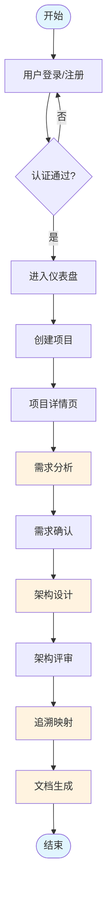
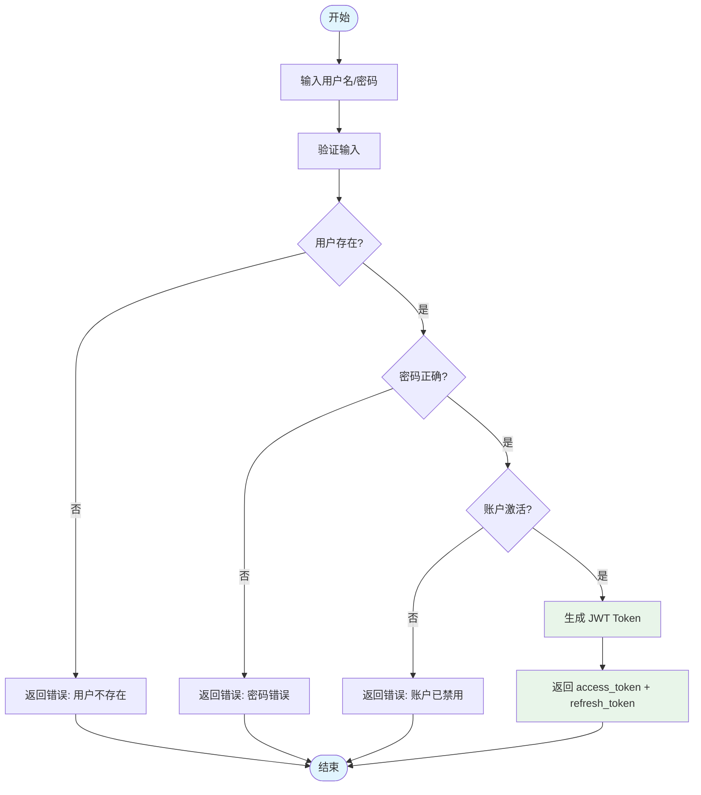
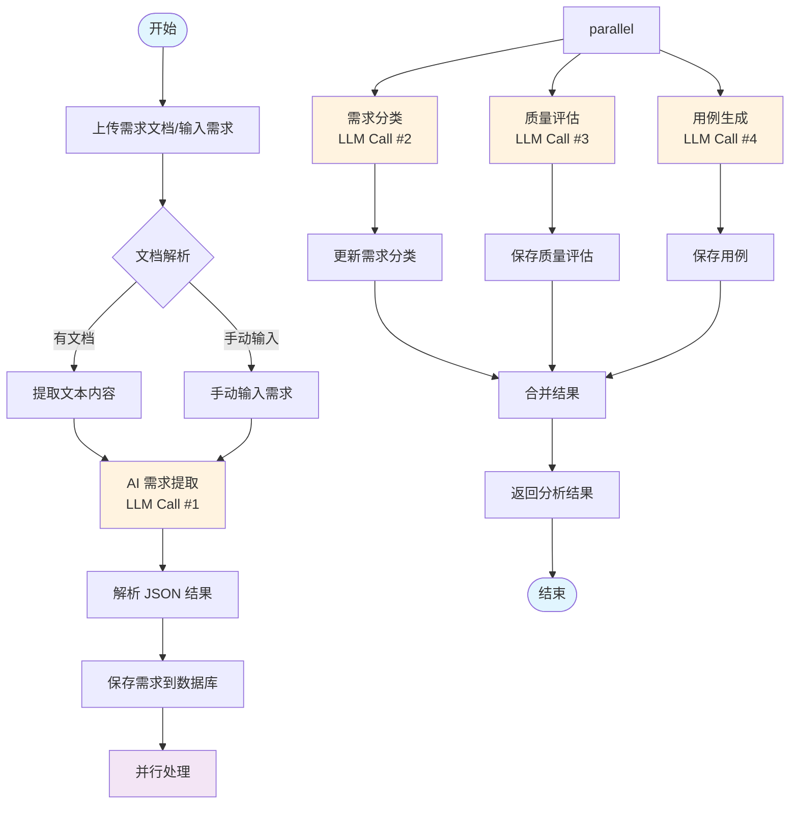
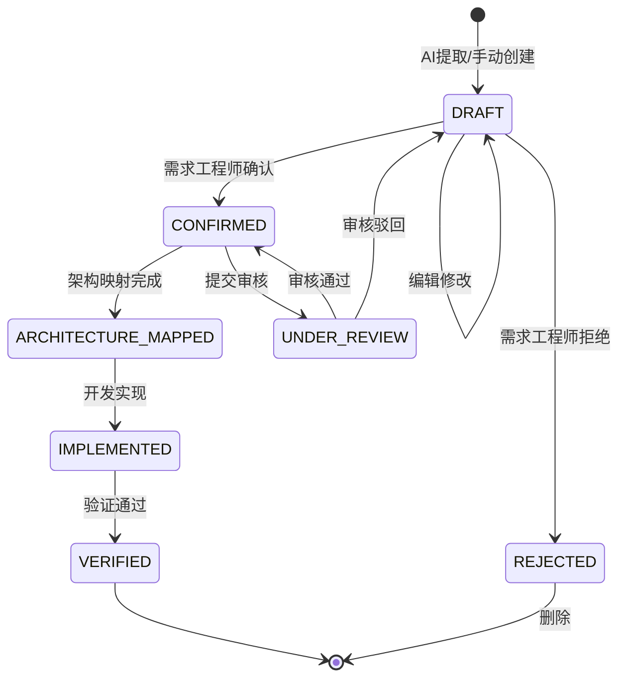
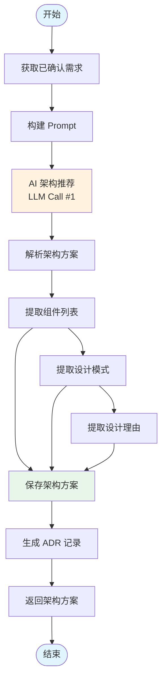
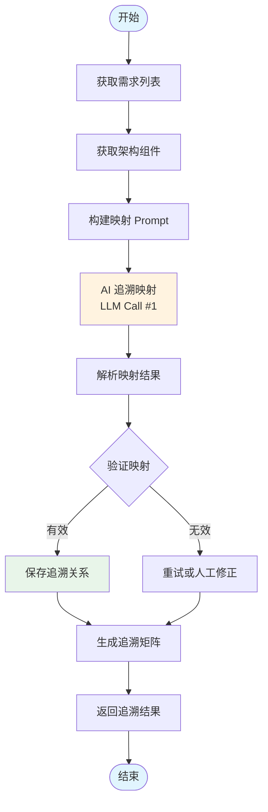
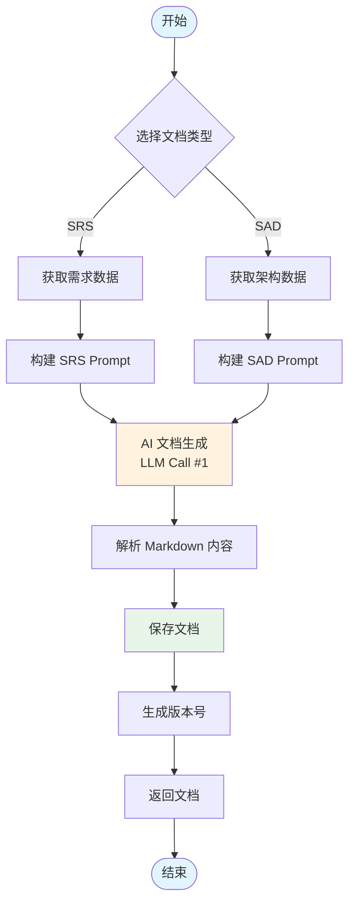
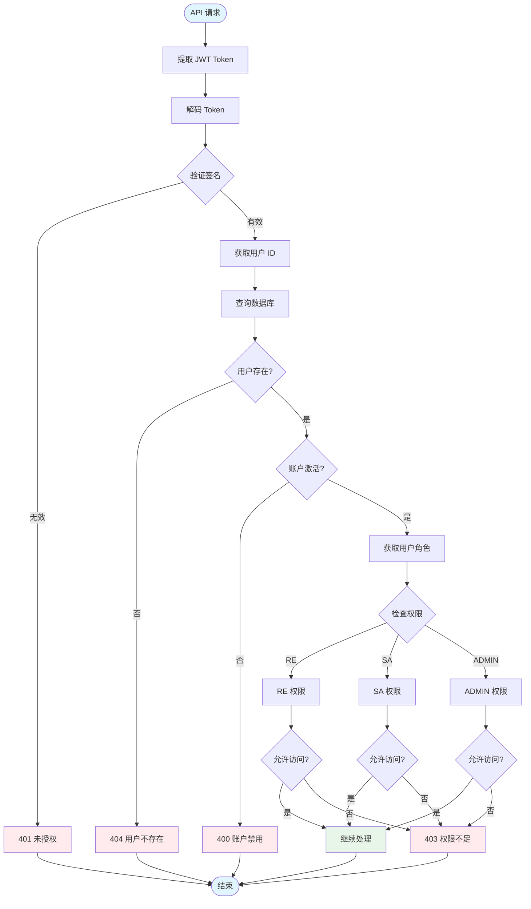
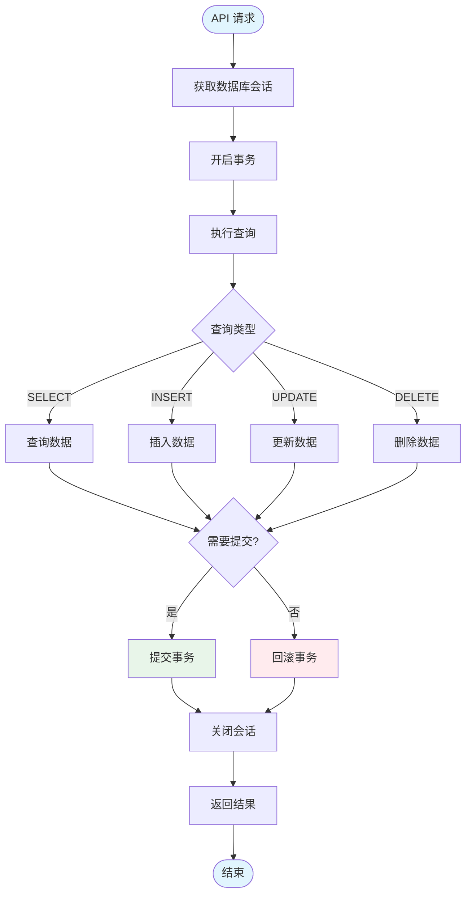
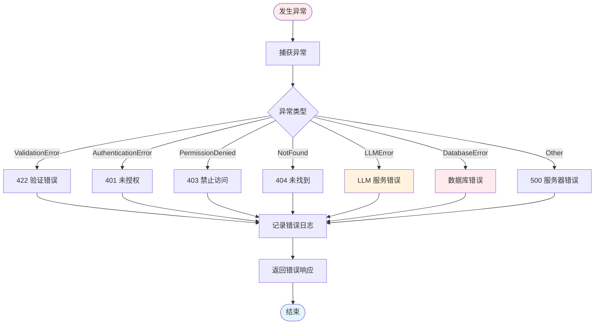

# AI-SE Assistant 业务流程图

  

---

## 1. 系统整体工作流程

---

## 2. 用户认证流程

---

## 3. AI 需求分析工作流程（核心）

---

## 4. 需求状态流转图

---

## 5. AI 架构推荐工作流程

---

## 6. AI 追溯映射工作流程

---

## 7. 文档生成工作流程

---

## 8. RBAC 权限检查流程

---

## 9. 数据库操作流程

---

## 10. 错误处理流程

---

## 说明

本文档使用 Mermaid 语法绘制，可在支持 Mermaid 的 Markdown 编辑器中渲染（如 VS Code、Typora、GitHub 等）。

**颜色说明：**
- 蓝色 (#e1f5fe)：开始/结束节点
- 橙色 (#fff3e0)：AI 调用节点
- 绿色 (#e8f5e9)：成功/保存节点
- 红色 (#ffebee)：错误/异常节点
- 紫色 (#f3e5f5)：并行处理节点
