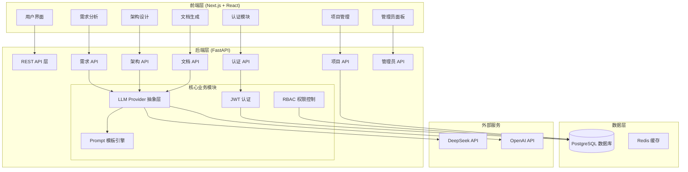
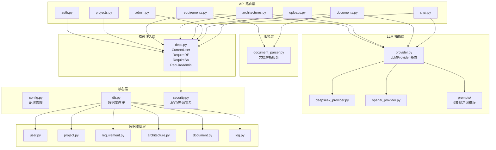
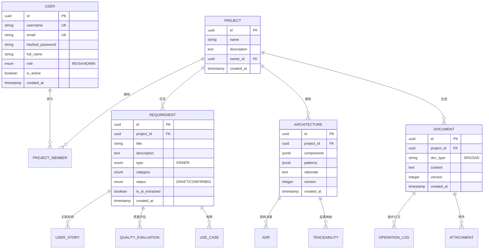
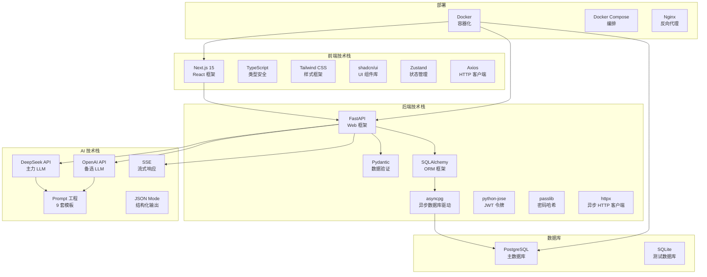
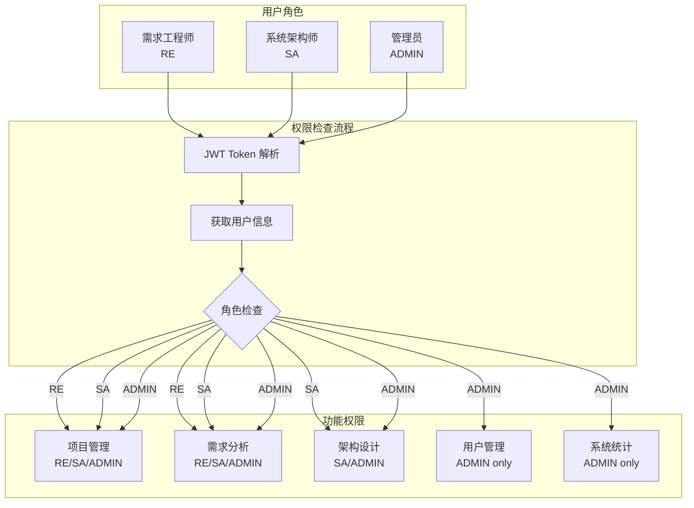

# AI-SE Assistant 系统架构图

---

## 1. 系统总体架构图

---

## 2. 后端分层架构图

---

## 3. 数据模型关系图

---

## 4. 技术栈架构图

---

## 5. 权限控制架构图

---

## 说明

本文档使用 Mermaid 语法绘制，可在支持 Mermaid 的 Markdown 编辑器中渲染（如 VS Code、Typora、GitHub 等）。
